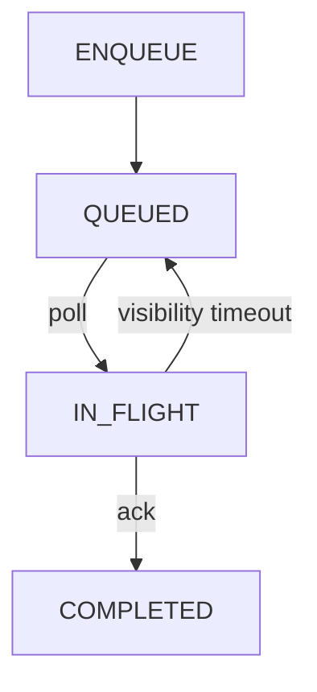

# Mini-SQS — A Simplified Task Queue with Visibility Timeout

Mini-SQS is a lightweight task queue that implements core SQS semantics: enqueue, exclusive polling with visibility timeout, acknowledgement-based completion, and real-time metrics. The project focuses on correctness, state invariants, and failure-aware task handling with WAL-based durability rather than UI.

## Task Lifecycle



## Live Demo (2 minutes)

### Step 1: Start server
```bash
# Terminal 1
go run cmd/server/main.go
```
*Server listens on :8080*

### Step 2: Enqueue a task
```bash
# Terminal 2
curl -X POST http://localhost:8080/enqueue \
  -H "Content-Type: application/json" \
  -d '{"task_id": "demo-task-1", "payload": "hello world"}'
```
**Expected result:** `200 OK`

### Step 3: Poll (exclusive delivery)
```bash
curl -X POST http://localhost:8080/poll \
  -H "Content-Type: application/json" \
  -d '{"worker_id": "worker-1"}'
```
**Expected:**
- State: `IN_FLIGHT`
- Returns task JSON

### Step 4: Ack
```bash
curl -X POST http://localhost:8080/ack \
  -H "Content-Type: application/json" \
  -d '{"task_id": "demo-task-1", "worker_id": "worker-1"}'
```

### Step 5: Verify metrics
```bash
curl http://localhost:8080/metrics
```
**Expected invariant:** `total = pending + in_flight + completed`

## Input Validation

```bash
curl -X POST http://localhost:8080/enqueue -d '{}'
```
**Expected:** `400 Bad Request`

*Invalid tasks never enter the queue, preserving system integrity.*

## Metrics Explanation

| Metric | Description |
|--------|-------------|
| `pending_tasks` | Waiting to be processed |
| `in_flight_tasks` | Currently owned by workers (invisible to others) |
| `completed_tasks` | Successfully acknowledged |
| `total_tasks` | Lifetime count (pending + in_flight + completed) |

## Design Decisions & Tradeoffs

- **Custom WAL Persistence**: Uses a Write-Ahead Log for durability instead of a heavy database, ensuring tasks are safe even on crash.
- **Single-node queue**: Designed as a single process for simplicity; no distributed consensus (Raft/Paxos).
- **No Dead Letter Queue**: Failed tasks will retry indefinitely when visibility times out.
- **In-Memory Index**: State is held in memory for speed, backed by WAL.

These were deliberate choices to focus on correctness of queue semantics and state transitions without external dependencies.

## Roadmap

- [ ] Visibility timeout configurable per task
- [ ] Dead-letter queue (DLQ) support
- [ ] Compaction for WAL
- [ ] Concurrent worker testing suite
